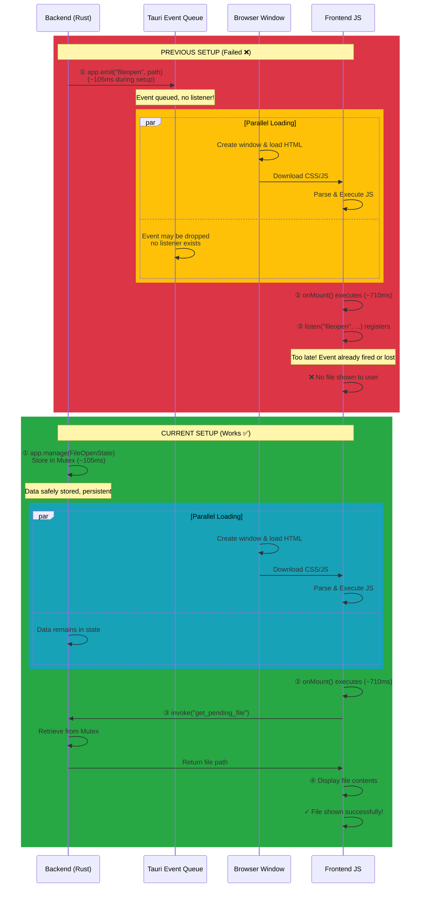
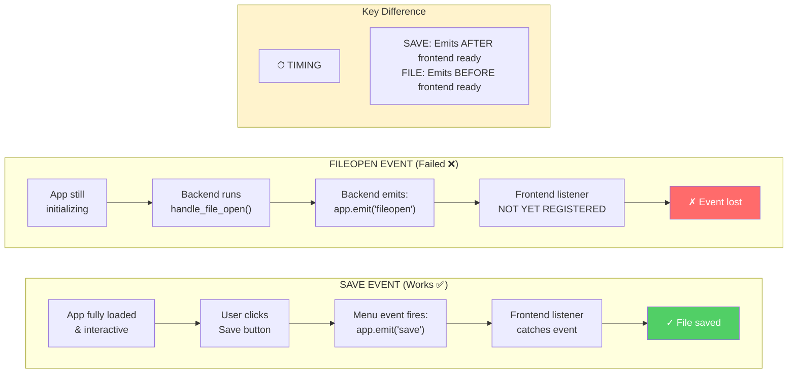
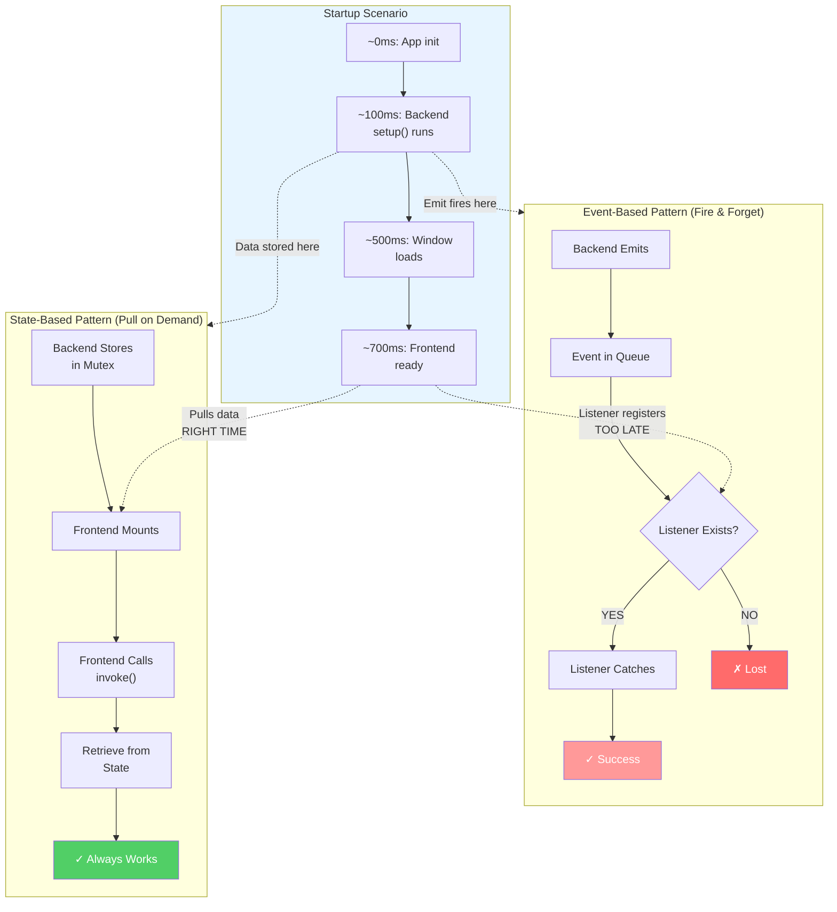

# File Opening Architecture: Previous vs Current Implementation

## Executive Summary

**Previous Approach:** Backend emits event → Frontend listens (FAILED)
**Current Approach:** Backend stores state → Frontend pulls on mount (WORKS)

The core issue: **Timing of Event Listener Registration vs Event Emission**

---

## Detailed Comparison

### PREVIOUS SETUP (Failed ❌)

```rust
// file_open_listener.rs (OLD)
pub fn handle_file_open<R: Runtime>(
    app: &AppHandle<R>,
) -> Result<(), Box<dyn std::error::Error + 'static>> {
    let args: Vec<String> = std::env::args().collect();
    if args.len() > 1 {
        let file_path = &args[1];
        app.emit_str("fileopen", file_path.to_string())  // ← Event emitted here
    }
    Ok(())
}
```

**When this executes:**
- During Tauri's `.setup()` phase
- Approximately: `App Init → App State Setup → Event Emitted → App Starts → Window Loads → Frontend JS Loads → Frontend Listener Registered`

**Timeline:**
```
Time 0ms:    Tauri builder setup() called
Time 100ms:  handle_file_open() executes
Time 105ms:  app.emit("fileopen", path) fires ← EVENT SENT
Time 200ms:  Tauri window created and visible
Time 500ms:  HTML/CSS/JS resources download
Time 700ms:  Svelte component mounts
Time 710ms:  listen("fileopen", ...) registers ← LISTENER REGISTERED TOO LATE!
```

**The Problem:**
- Event is emitted at ~105ms
- Frontend listener registers at ~710ms
- **The event is lost because the listener doesn't exist yet**
- This is a classic "fire-and-forget" event emission race condition

### Visual Timeline of the Race Condition



---

### CURRENT SETUP (Working ✅)

```rust
// file_open_listener.rs (NEW)
pub struct FileOpenState {
    pub pending_file: Mutex<Option<String>>,
}

pub fn handle_file_open<R: Runtime>(
    app: &mut tauri::App<R>,
) -> Result<(), Box<dyn std::error::Error + 'static>> {
    let args: Vec<String> = std::env::args().collect();
    let file_path = if args.len() > 1 {
        Some(args[1].clone())
    } else {
        None
    };
    
    app.manage(FileOpenState {              // ← Store in app state
        pending_file: Mutex::new(file_path),
    });
    Ok(())
}
```

**When frontend retrieves it:**
```svelte
onMount(() => {
  const pendingFile = await invoke<string | null>("get_pending_file");
  if (pendingFile) handleFileOpen(pendingFile, ...);
});
```

**Timeline:**
```
Time 0ms:    Tauri builder setup() called
Time 100ms:  handle_file_open() executes
Time 105ms:  File path stored in Mutex ← DATA STORED
Time 200ms:  Tauri window created and visible
Time 500ms:  HTML/CSS/JS resources download
Time 700ms:  Svelte component mounts
Time 710ms:  onMount() hook runs
Time 712ms:  invoke("get_pending_file") called ← RETRIEVES DATA ON DEMAND
Time 715ms:  File content displayed ← SUCCESS!
```

**Why it Works:**
- Data is safely stored in app state (thread-safe Mutex)
- Frontend explicitly requests it when ready via `invoke()` command
- No race condition: pull-based instead of push-based
- Data persists in state until retrieved

---

## Why `app.emit("save")` Works But `app.emit("fileopen")` Didn't

### The Save Event (Works ✅)

```rust
// file_menu.rs
pub fn handle_file_menu_events<R: Runtime>(app: &AppHandle<R>, event: &MenuEvent) {
    if event.id().as_ref() == "save" {
        let _ = app.emit("save", "");  // ← Emitted during user interaction
    }
}
```

**When this occurs:**
- User clicks "Save" button → Menu event fires → `handle_file_menu_events()` called
- This happens **after** the frontend is fully loaded and listening
- The listener is already registered: `listen("save", (_) => { ... })`

**Timeline:**
```
Time 700ms:  Svelte mounts
Time 710ms:  onMount() sets up all listeners including listen("save", ...)
             ↓
             [User is now interacting with the app]
             ↓
Time 5000ms: User clicks Save
Time 5001ms: Menu event fires
Time 5002ms: app.emit("save") called
Time 5003ms: Frontend listener catches the event ← SUCCESS!
```

**Why it succeeds:** The listener is guaranteed to exist before the emit happens.

---

### The FileOpen Event (Failed ❌)

```rust
// file_open_listener.rs (OLD)
pub fn handle_file_open<R: Runtime>(
    app: &AppHandle<R>,
) -> Result<>, Box<dyn std::error::Error + 'static>> {
    // ...
    app.emit_str("fileopen", file_path.to_string())  // ← Emitted during setup
}
```

**When this occurs:**
- During Tauri setup phase
- **Before** the frontend even exists
- **Before** any listener is registered
- This is a classic **"push to non-existent listener"** problem

**Why it fails:** The listener doesn't exist yet when the event is emitted.

### Event Timing Comparison Diagram



---

## Technical Root Cause Analysis

| Aspect | Previous (emit) | Current (state + pull) |
|--------|-----------------|----------------------|
| **Pattern** | Push / Fire-and-Forget | Pull / On-Demand |
| **Queue** | Tauri event queue (if exists) | App state (Mutex) |
| **Listener Required** | YES (must exist before emit) | NO (exists whenever retrieved) |
| **Race Condition** | High risk | None |
| **Data Persistence** | Lost if no listener | Persists until .take() |
| **Thread Safe** | ✓ (event system is thread-safe) | ✓ (Mutex is thread-safe) |
| **Timing Dependency** | Strict (listener must be ready) | Flexible (pulled on demand) |
| **Reliability** | Low (startup scenario) | High (all scenarios) |

---

## Why Tauri's Event System Isn't Suitable for Startup Data

**Tauri Events are designed for:**
- Runtime communication (after app is loaded)
- User-triggered events (menu clicks, keyboard shortcuts)
- Window-to-window messaging
- Cases where listeners are guaranteed to exist

**Tauri Events are NOT designed for:**
- Passing data during initialization
- Cases where listeners might not exist yet
- Guaranteed delivery requirements

**Evidence from Tauri Internals:**
- Events may not be queued if no listener exists
- Events are intended for live communication
- App state is the proper mechanism for setup-time data

---

## Solution Pattern Comparison

### Pattern 1: Event-based (❌ Failed)
```rust
// Emits during setup - listener might not exist
app.emit("fileopen", data)  
```

### Pattern 2: State-based (✅ Works)
```rust
// Store during setup - retrieve when ready
app.manage(State { data })
let data = state.retrieve()  // Called from mounted component
```

### Pattern 3: Command-based (✅ Also Works)
```rust
// Similar to state pull - explicit on-demand retrieval
#[tauri::command]
fn get_data() -> String { ... }

// Frontend calls when ready
invoke("get_data")
```

### Pattern Comparison Diagram



---

## Why This Architecture is Robust

### 1. **Guaranteed Execution Order**
Frontend can only call Tauri commands after it's fully loaded and the JS bridge is ready.

### 2. **Thread Safety**
- `Mutex<Option<T>>` ensures safe multi-threaded access
- Multiple threads can share the state safely

### 3. **No Data Loss**
- Data persists in Mutex until explicitly retrieved
- Not subject to event queue mechanics

### 4. **Error Handling**
- Frontend explicitly checks if pending file exists
- Graceful handling if no file was passed

### 5. **Scalability**
- Can store multiple pending items
- Pattern works for any startup-time data

---

## Summary

| Question | Answer |
|----------|--------|
| Why did emit fail? | Listener didn't exist when event was emitted (timing issue) |
| Why does state work? | Data persists, frontend retrieves when ready (no timing dependency) |
| Why does save emit work? | It fires after frontend loads (guaranteed listener exists) |
| When to use emit? | User interaction events and runtime communication |
| When to use state? | Initialization data and startup values |
| Why not queue events? | Tauri events aren't designed for startup; state is the proper pattern |
